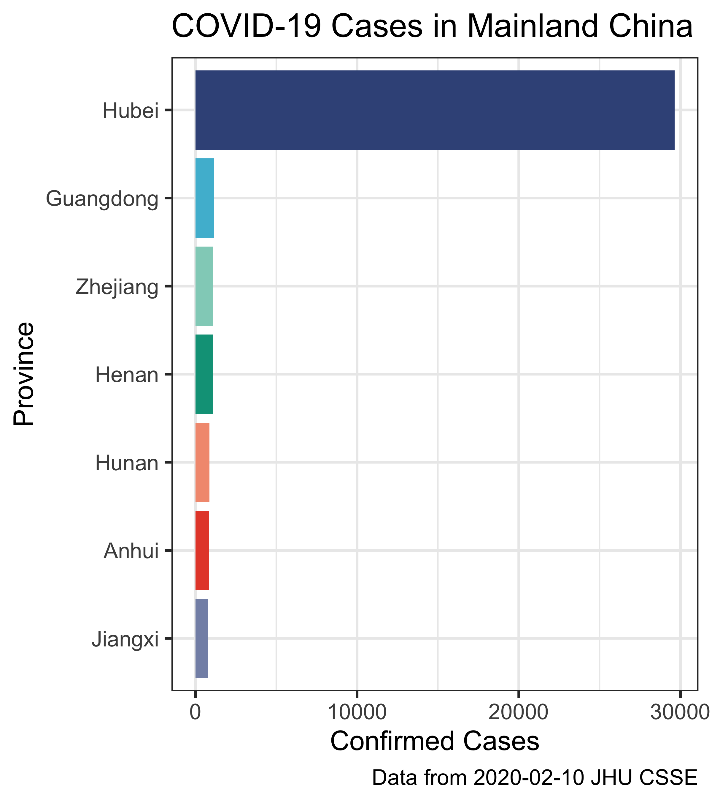

# Rforbio
Repository for an introductory to R workshop at MSU.  This is an introductory workshop designed to introduce R programming to analyze data.  The first part of the workshop will be installing R/Rstudio and analyzing baby names from the Social Security Administration of all individuals born in the US.  The second part of the workshop will focus on building using applying these skills to analyze the 2019 novel Coronavirus outbreak.

# Preworkshop
[**Install Base R**](https://cran.r-project.org/)

[**Install Rstudio**](https://rstudio.com/products/rstudio/download/#download)

# Instructions
[Download/clone the workshop folder](https://github.com/nguyens7/Rforbio/archive/master.zip)

During this workshop we'll learn how to create figures from data obtained from JHU CSSE
